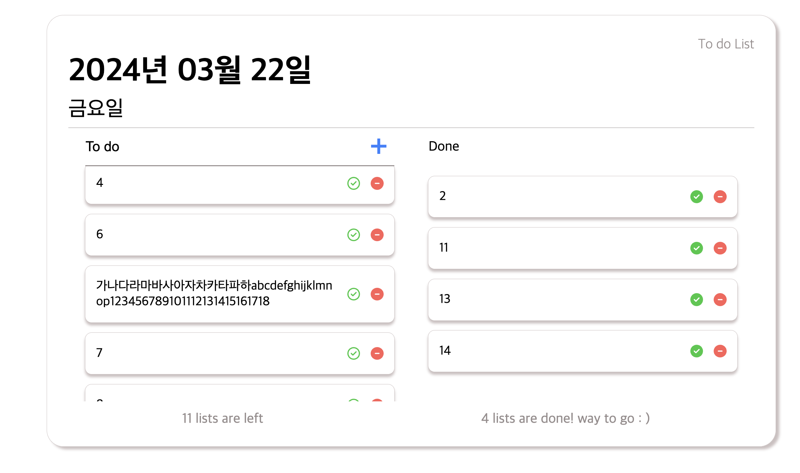
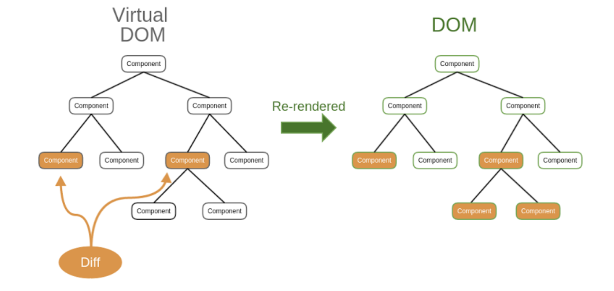
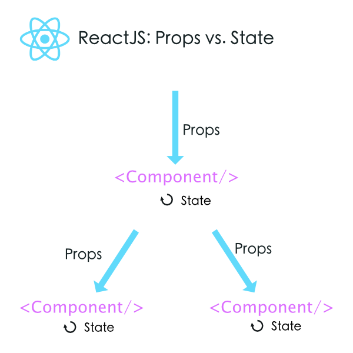

## 🔗 배포 링크

[https://react-todo-19th-psi.vercel.app/](https://react-todo-19th-psi.vercel.app/)

## 🕶️ 기능구현

- todo 추가하기
- local storage 구현
- check버튼 클릭시 todo ↔ done으로 이동
- delete버튼 클릭시 local storage에서 삭제
- text overflow 관리
- scroll 가능

## 👩‍💻 느낀점

지난 미션에서 local storage를 포함해서 여러가지 구현하지 못해 아쉬웠던 점을 많이 보완하고자 노력했습니다..! local storage로 데이터를 다루다 보니까 배열 형태를 가공하는 것이 많이 어려워서 헤매다 보니 시간이 부족해서 다른 분들의 코드를 많이 참고했습니다. 여전히 기능을 구현하는 것에 더 집중 해야겠다고 다짐했습니다. 리액트가 더 편할거라고 생각했는데 hook과 친해지지 못해서인지 오히려 더 어려웠던 미션이었습니다..🥹

## 👻 어려웠던점

1. deleteTodo() 가 toggleTodo() 이후에 불려오면 에러가 남
deleteTodo 함수가 filter를 통해 새롭게 배열을 반환해주기 때문에 이 함수가 먼저 오면 undefined가 뜸.
따라서 useEffect를 통해 직접 제어해 줄 수 있으면 더 좋았을거라고 생각하지만, 정확한 구현은 하지 못해 생각을 더 해보아야 할 것 같다. 배열 자체를 todolist에 들어갈 것과 donelist에 들어갈것으로 나누어서 아예 분리된 배열을 만드는 것도 고려해 봤지만, 로컬스토리지 크기 자체가 작아서 효율적이지 않다고 생각함.
2. deleteTodo함수에서 직접 배열 인덱스를 찾아서 slice하는 방법도 고민해보고 직접 구현해 보았지만, 인덱스로 찾게되면 매번 마운팅 될 때 마다 id 값이 일치하는 것을 찾고, 또 인덱스 값을 매번 계산하게 되어 여러번의 순차탐색을 하게되므로 효율성이 떨어진다고 생각함.
3. 아직 props와 친해지지 못해서 ToDo 컴포넌트에 거의 모든 기능을 몰아넣고 자식 컴포넌트에 하나하나 props로 전달하는 방법만 썼으나, 좀더 효율적인 컴포넌트 구성을 고민하고 배치하여 한 컴포넌트에 하나의 기능이 들어갈 수 있게 재사용성이 좋은 컴포넌트를 만들어야겠다고 반성함.
4. 막상 html에서 react로 넘어가니 익숙하지 않았다. useState 뿐 아니라 useEffect로도 관리 할 수 있었으면 훨씬 좋았을 것 같다.
5. 사소한 부분이지만, 날짜를 가져오는 라이브러리도 많이 쓰이던 moment.js는 잘 안쓰이는 추세이고 훨씬 가벼운 days 라이브러리를 사용했다. 포맷 변환도 어려웠는데 days는 한국어도 지원하기 때문에 days github 를 참고해서 포맷하면 유용하다.

## 🔑 key questions

<aside>
1️⃣ **Virtual-DOM은 무엇이고, 이를 사용함으로서 얻는 이점은 무엇인가요?**

리액트에서는 virtual-DOM을 사용한다. virtual-DOM이란, 실제 DOM(Document Object Model)을 조작하는 방식이 아닌, 실제 DOM을 모방한 가상의 DOM을 구성해 원래 DOM과 비교하여 달라진 부분을 리렌더링 하는 방식으로 작동한다.
실제 DOM에는 브라우저가 화면을 그리는데 필요한 모든 정보가 들어있기 때문에 속도가 느리다는 단점이 있다. 리액트는 깜빡거림 없이 부드러운 UX를 사용자에게 제공하고자 변경사항만 빠르게 파악하고 리렌더링 하기 위해 DOM을 만들어 비교한다. 리액트는 성능 향상을 위해 실제 렌더링된 UI를 내부적으로 자바스크립트 객체로 따로 관리한다.

</aside>

<aside>
2️⃣ **미션을 진행하면서 느낀, React를 사용함으로서 얻을수 있는 장점은 무엇이었나요?

1. virtual-DOM을 통해 리액트를 사용하지 않았을 때 보다 훨씬 빠른 렌더링이 가능했다. 
2. 기존에는 append를 통해 리스트를 관리했다면, 리액트는 list 하나를 컴포넌트로 빼두어서 더 쉽게 관리할 수 있었다.
3. 기능별 또는 페이지 별로 컴포넌트로 관리해서 오류를 고칠 때 훨씬 쉽게 오류가 난 부분을 찾을 수 있었다.
4. 라이브러리 적용이 쉽고 props로 빼두어 코드가 훨씬 간결해졌다.

</aside>

<aside>
3️⃣ **React에서 상태란 무엇이고 어떻게 관리할 수 있을까요?**

컴포넌트 내부에서 변할수 있는 값이다. 상태는 React State로 다룰 수 있다.

</aside>

<aside>
3️⃣ **Styled-Components 사용 후기 (CSS와 비교)**

가장 먼저 자주 쓰는 스타일을 props로 처리할 수 있다는 점이 가장 좋았다. 그 외에도 default 스타일을 적용하고 특정 컴포넌트에만 약간 변형된 스타일을 적용 할 수 있다는 것도 배웠는데, 아직 사용 해 보지는 못했다.

</aside>
